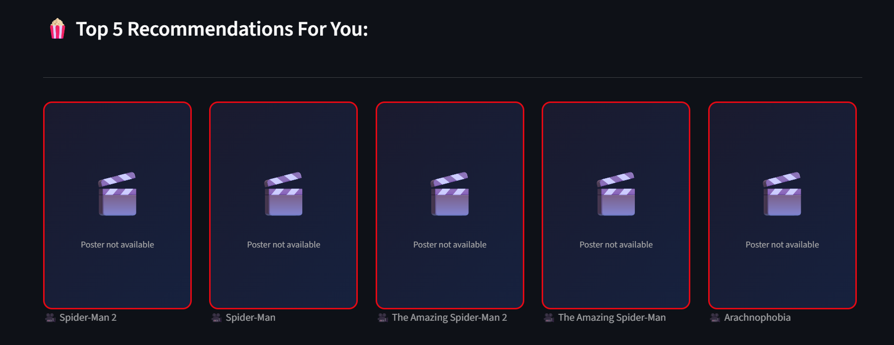

# 🎬 Movie Recommender System

A Machine Learning-based Movie Recommendation System that suggests movies similar to a user's favorite movie using **Content-Based Filtering** and **Cosine Similarity**. Built with **Python**, **Scikit-Learn**, **Streamlit**, and **TMDB API** for dynamic movie poster fetching.

---

## 🚀 Features

- 🔍 Search and select any movie
- 🎯 Get Top 5 similar movie recommendations
- 🖼️ Dynamic movie poster fetching using TMDB API
- ⚡ Fast recommendations using cosine similarity
- 🎨 Interactive Streamlit UI
- 🎬 Fallback poster display when posters are unavailable
- 📱 Clean and responsive design

---

## 🛠️ Tech Stack

- Python
- Pandas
- NumPy
- Scikit-Learn
- Streamlit
- TMDB API
- Pickle

---

## 📂 Project Structure

```bash
Movie-Recommender-System/
│
├── app.py
├── Movie_Recommender.ipynb
│
├── model/
│   ├── movie_list.pkl
│   └── similarity.pkl
│
├── dataset/
│   ├── movies.csv
│   └── credits.csv
│
├── requirements.txt
└── README.md
```

---

## ⚙️ How It Works

### 1. Data Preprocessing

- Merge movies and credits datasets
- Handle missing values
- Extract important features such as:
  - Genres
  - Keywords
  - Cast
  - Crew
  - Overview

### 2. Feature Engineering

All relevant movie information is combined into a single **tags** column.

Example:

```text
Action Adventure Marvel Superhero Spider-Man
```

### 3. Vectorization

Text data is converted into numerical vectors using CountVectorizer.

```python
from sklearn.feature_extraction.text import CountVectorizer

cv = CountVectorizer(max_features=5000, stop_words='english')
vectors = cv.fit_transform(movies['tags']).toarray()
```

### 4. Similarity Calculation

Cosine Similarity is used to measure similarity between movies.

```python
from sklearn.metrics.pairwise import cosine_similarity

similarity = cosine_similarity(vectors)
```

### 5. Recommendation Process

1. User selects a movie
2. Movie index is identified
3. Similarity scores are retrieved
4. Top 5 similar movies are selected
5. Posters are fetched using TMDB API
6. Recommendations are displayed

---

## 📸 Screenshots

### Home Page


### Recommendations



---

## 🔑 TMDB API Integration

Movie posters are fetched using:

```python
https://api.themoviedb.org/3/movie/{movie_id}
```

Poster URL:

```python
https://image.tmdb.org/t/p/w500/{poster_path}
```

---

## 💻 Installation

### Clone Repository

```bash
git clone https://github.com/ShraddhaPatel1906/Movie-Recommender-System.git

cd Movie-Recommender-System
```

### Install Dependencies

```bash
pip install -r requirements.txt
```

### Run Application

```bash
streamlit run app.py
```

---

## 📦 Requirements

```txt
streamlit
pandas
numpy
scikit-learn
requests
```

---

## 🎯 Future Improvements

- Movie Ratings Integration
- Trailer Support
- Personalized Recommendations
- Hybrid Recommendation System
- User Authentication
- Recommendation History

---

## 🧠 Machine Learning Concepts Used

- Content-Based Filtering
- Natural Language Processing (NLP)
- Feature Engineering
- Vectorization
- Cosine Similarity
- Recommendation Systems

---

## 👩‍💻 Author

**Shraddha Patel**  
🎓 M.Sc. Data Science, IIIT Lucknow

GitHub: https://github.com/ShraddhaPatel1906

---

## ⭐ Support

If you found this project useful, please give it a **Star ⭐** on GitHub.